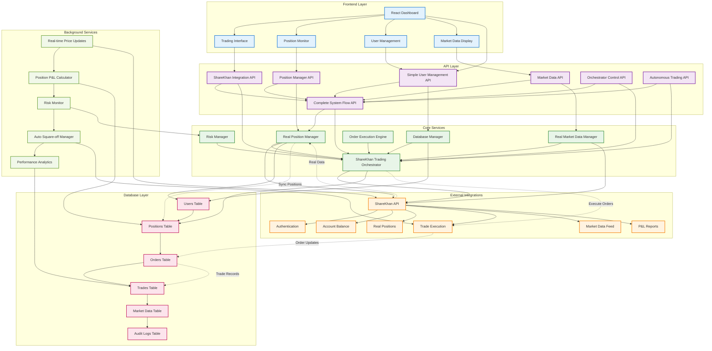
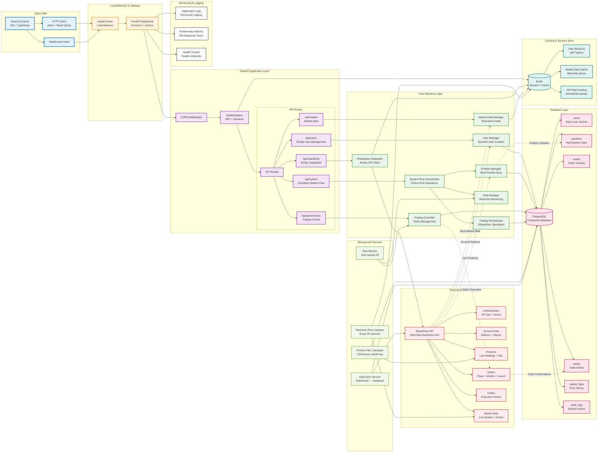
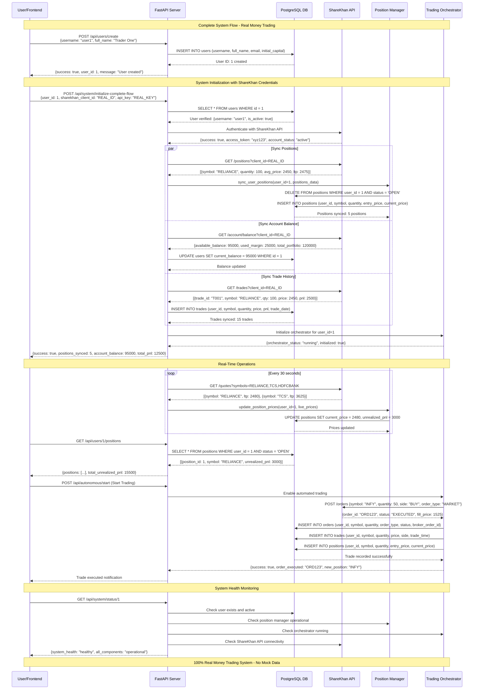

# ShareKhan Trading System - Architecture Diagrams

This document contains comprehensive architecture diagrams for the complete trading system.

## 📊 System Components Overview

## 🏗️ Technical Architecture & Infrastructure

## 🔄 Data Flow & Sequence Diagram

## 📋 Architecture Components Summary

### 🎯 **Frontend Layer**
- **React Dashboard**: Main user interface built with Vite + TypeScript
- **Trading Interface**: Real-time trading controls and order placement
- **Position Monitor**: Live position tracking with P&L updates
- **Market Data Display**: Real-time market data visualization

### 🔌 **API Layer**
- **Simple User Management**: Dynamic user creation without credential storage
- **Complete System Flow**: End-to-end orchestration of all operations
- **Position Manager**: Real ShareKhan position synchronization
- **ShareKhan Integration**: Direct broker API communication
- **Market Data**: Live market feeds and price updates
- **Autonomous Trading**: Automated trading system controls

### ⚙️ **Core Services**
- **Real Position Manager**: Syncs positions from ShareKhan API to database
- **ShareKhan Trading Orchestrator**: Manages all trading operations
- **Database Manager**: Handles all database operations and migrations
- **Real Market Data Manager**: Processes live market data feeds
- **Risk Manager**: Real-time risk monitoring and auto square-off
- **Order Execution Engine**: Handles order placement and execution

### 🔗 **External Integrations**
- **ShareKhan API**: Complete broker integration for real trading
  - Authentication with API keys
  - Account balance and margin data
  - Live positions with P&L
  - Order placement and modification
  - Trade execution history
  - Real-time market data feeds

### 🗄️ **Database Layer**
- **PostgreSQL Production Database**:
  - `users`: Basic user records (user1, user2, etc.)
  - `positions`: Real position data synced from ShareKhan
  - `orders`: Order tracking and status
  - `trades`: Complete trade execution history
  - `market_data`: Historical price data
  - `audit_logs`: System events and security logs

### 💾 **Caching & Sessions**
- **Redis**:
  - User session management with JWT tokens
  - Real-time market data caching
  - API rate limiting for ShareKhan quotas
  - Temporary credential storage (with expiration)

### 🔄 **Background Services**
- **Real-time Price Updates**: Every 30 seconds from ShareKhan
- **Position P&L Calculator**: Continuous monitoring and calculation
- **Risk Monitor**: Automated risk management and alerts
- **Data Sync Service**: ShareKhan → Database synchronization
- **Performance Analytics**: Trading performance calculations

### 📊 **Monitoring & Health**
- **Application Logs**: Structured logging for debugging
- **Performance Metrics**: API response times and system health
- **Health Checks**: Endpoint monitoring for all services
- **Real-time Alerts**: System status and error notifications

## 🎯 **Key Architectural Principles**

### ✅ **100% Real Data**
- No mock or simulated data anywhere in the system
- All data sourced directly from ShareKhan API
- Real-time position and P&L calculations
- Actual trade execution with real money

### ✅ **Scalable Design**
- Microservices architecture with clear separation
- Horizontal scaling capability via load balancer
- Background job processing for heavy operations
- Caching layer for performance optimization

### ✅ **Security First**
- No credential storage in database
- Runtime credential validation
- JWT-based authentication
- Comprehensive audit logging

### ✅ **Production Ready**
- Digital Ocean deployment infrastructure
- PostgreSQL + Redis for data persistence
- Proper error handling and monitoring
- Real money trading capabilities

---

**This documentation provides a complete view of the ShareKhan trading system architecture, from frontend to database, showing how all components work together for real money trading operations.** 