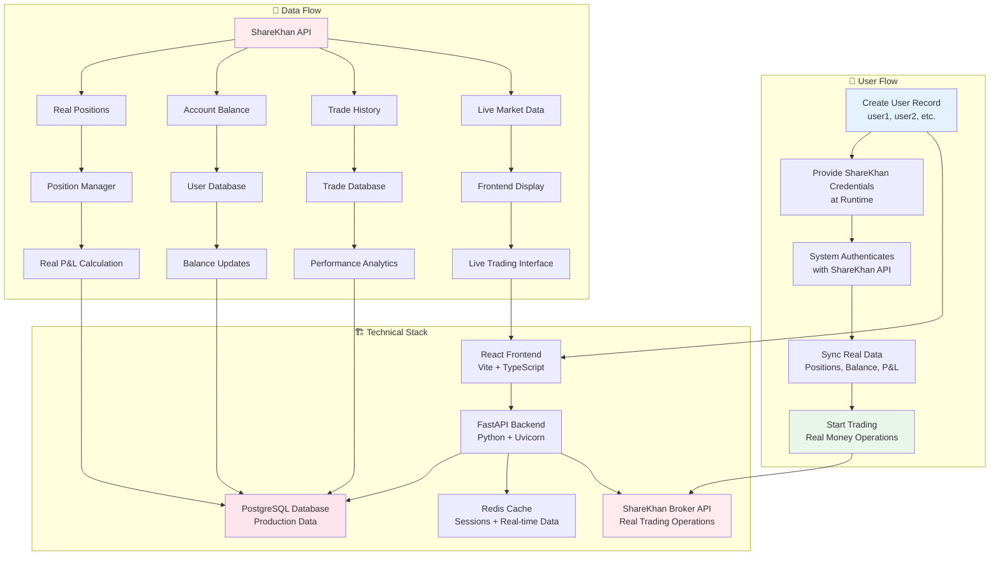

# ShareKhan Trading System - Quick Overview

## 🚀 System Flow Diagram



## 📋 Key Components

| Component | Purpose | Technology |
|-----------|---------|------------|
| **Frontend** | User interface for trading | React + Vite + TypeScript |
| **Backend API** | Business logic and orchestration | FastAPI + Python |
| **Database** | Data persistence | PostgreSQL |
| **Cache** | Sessions and real-time data | Redis |
| **Broker** | Real trading operations | ShareKhan API |
| **Position Manager** | Real position sync from ShareKhan | Python + AsyncIO |
| **Trading Orchestrator** | Automated trading system | Python + Background Tasks |

## 🎯 Core Features

### ✅ **100% Real Trading**
- No mock or demo data
- Real ShareKhan API integration  
- Actual money trading operations
- Live P&L calculations

### ✅ **Dynamic User Management**
- Create users on-demand (user1, user2, etc.)
- No credential storage in database
- Runtime authentication with ShareKhan
- Scalable user addition

### ✅ **Real-Time Operations**
- Live position updates every 30 seconds
- Real market data feeds
- Automated risk management
- Background price calculations

### ✅ **Production Infrastructure**
- Digital Ocean deployment
- PostgreSQL for reliability
- Redis for performance
- Comprehensive monitoring

## 🔗 API Endpoints Quick Reference

```bash
# User Management
POST /api/users/create                    # Create new user
GET  /api/users/list                      # List all users
GET  /api/users/{id}                      # Get user details

# System Flow
POST /api/system/initialize-complete-flow # Initialize entire system
GET  /api/system/status/{user_id}         # System health check

# Position Management  
POST /api/users/{id}/sync-positions       # Sync from ShareKhan
GET  /api/users/{id}/positions            # Get user positions
POST /api/users/{id}/update-position-prices # Update live prices

# Trading Control
POST /api/autonomous/start                # Start automated trading
POST /api/autonomous/stop                 # Stop automated trading
GET  /api/autonomous/status               # Get trading status
```

## 🎯 Usage Example

1. **Create User**: `POST /api/users/create {"username": "trader1"}`
2. **Initialize System**: `POST /api/system/initialize-complete-flow` (with ShareKhan credentials)
3. **Start Trading**: `POST /api/autonomous/start`
4. **Monitor**: Use frontend dashboard for real-time monitoring

---

**This system is production-ready for real money trading with ShareKhan integration!** 🚀 